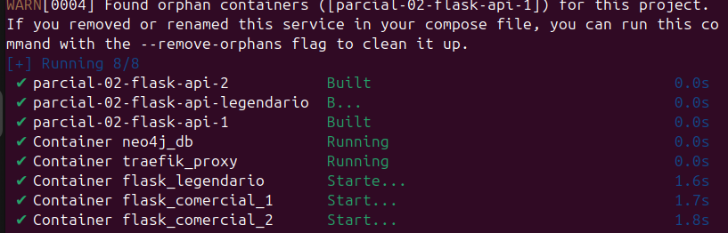
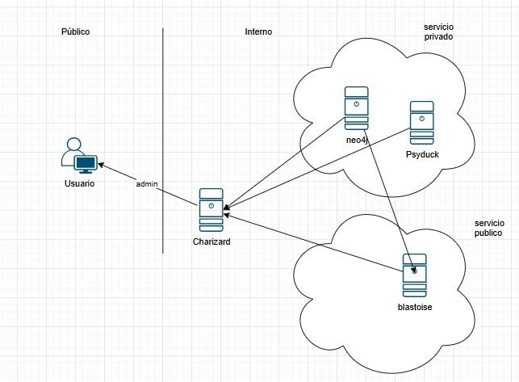

## Creación de las replicas y endpoint para legendarios

## Logs de las peticiones a los vuelos comerciales
Se puede ver como en cada peticion se dividen en las 2 replicas

# Etapa 3: Aduanas y Controles de Seguridad
## Analogías de Middlewares con Controles Aeroportuarios

### 1. BasicAuth

**Servicio**: Neo4j Database  
**Analogía**: Como el control de pasaporte en el aeropuerto, este middleware verifica la identidad del usuario mediante credenciales (usuario:contraseña) antes de permitir el acceso a la base de datos. Sin credenciales válidas, el acceso es denegado completamente.

### 2. Rate Limiting
# Primera solicitud existosa

# Se vuelve a hacer la solicitud en el mismo minuto (Fallo)

**Servicio**: API Flask Comercial  
**Analogía**: Similar al control de equipaje que tiene límites de peso y cantidad, este middleware limita la cantidad de peticiones a 1 por minuto para evitar la saturación del servicio y garantizar un acceso equitativo a todos los usuarios.

### 3. StripPrefix

**Servicio**: API Flask Legendario  
**Analogía**: Como el detector de metales que "limpia" o revisa los objetos antes de pasar, este middleware remueve el prefijo `/secure` de las URLs antes de enviarlas al servicio backend, procesando y sanitizando las rutas para mayor seguridad.

## Configuración de Seguridad Implementada

- **Neo4j**: Protegido con BasicAuth (admin:adminpassword)
- **API Comercial**: Rate limit de 1 req/min promedio
- **API Legendario**: Acceso vía `/secure/legendario` que se limpia a `/legendario`

### URLs de Acceso:
- **Neo4j Browser**: http://greninja.localhost (requiere auth)
- **API Comercial**: http://blastoise.localhost (con rate limit)
- **API Legendario**: http://blastoise.localhost/secure/legendario (con strip prefix)

# Etapa 4. Área restringida y sala de prensa Pokémon

## Area restringida
En la imagen se puede observar como llamando al mismo servicio de neo4j que se llamo anteriormente, ahora no se tiene acceso

## Sala de prensa
Se observa un nuevo servicio dando un mensaje de bienvenida y mostrando la hora del servidor

# Diagrama 

